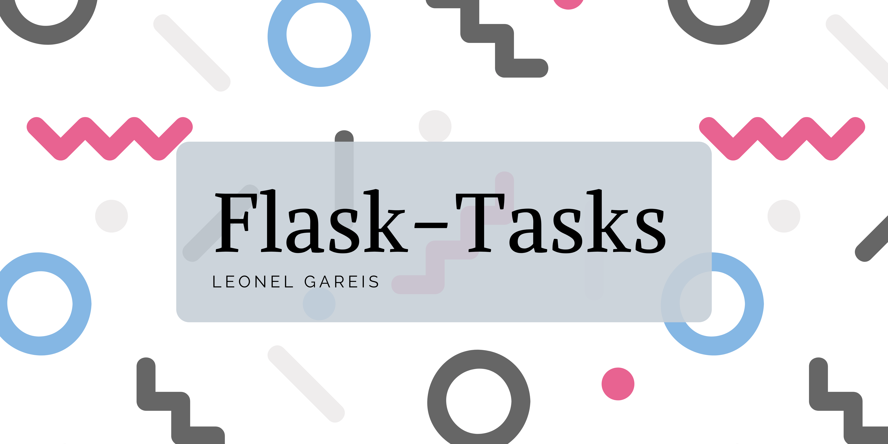

# Acerca del proyecto

Flask-Task es una aplicacion que permite gestionar tus tareas de una forma rapida y optima.
Con esta aplicacion, podras registrar usuarios y asignar tareas

# ¿Como usar la app?

Primero debes asegurarte de tener instalado Docker y `docker-compose` en tu PC.

En caso de tener estas herramientas, lo siguiente que debes hacer es abrir una terminal posicionandote en este directorio, y ejecutaras el siguiente comando:

```bash
docker-compose up
```

Esta instruccion, creara y ejecutara un contenedor dentro de tu PC con la aplicacion.

Para hacer uso de la app, vas a acceder a la siguiente [URL](http://localhost:8000)

Las rutas a las que podras acceder son las siguientes:

### Tareas

+ /tasks
+ /tasks/info
+ /tasks/{id}
+ /tasks?completed={true|false}
+ /tasks?title={text}
+ /tasks?completed={true|false}&title={text}

### Usuarios

+ /users
+ /users/{id}
+ /users/{id}/tasks